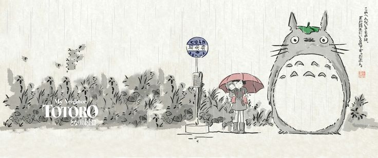

<h1 align="center">Lari Scalzaretto</h1>

Designer → Front‑End • UI/UX • Web Aesthetics & Performance

  

---

### About
Sou uma designer que está migrando para **Front‑End** com foco em **interfaces bonitas, acessíveis e responsivas**. Gosto de transformar identidade visual em componentes limpos e escaláveis.

- 🛠️ **Stack atual**: HTML, CSS, JavaScript, Git/GitHub.
- 🎯 **Em estudo**: React, UI Patterns, Design Systems, A11y.
- 🌱 **Objetivo 2025**: consolidar um portfólio front‑end sólido e profissional.

---

### Tech

---

### Destaques

| Projeto | Stack | Demo |
|---|---|---|
| **Pokedex JS** | HTML • CSS • JS | <a href="https://lariscalzaretto.github.io/js-developer-pokedex/">Live</a> |
| **MokkoCafé** | HTML • CSS | <a href="https://lariscalzaretto.github.io/mokkocafe-html/">Live</a> |
| **Landing estética** | HTML • CSS • JS | Em breve |

> Mais projetos nos repositórios fixados abaixo.

---

### Como trabalho
- Design → Wireframe → UI → Componentes → Código.
- Código limpo, semântica, responsividade e acessibilidade.
- Documentação enxuta e visual.

---

### Contato
Abra uma *issue* aqui no perfil ou envie um email. 👋
